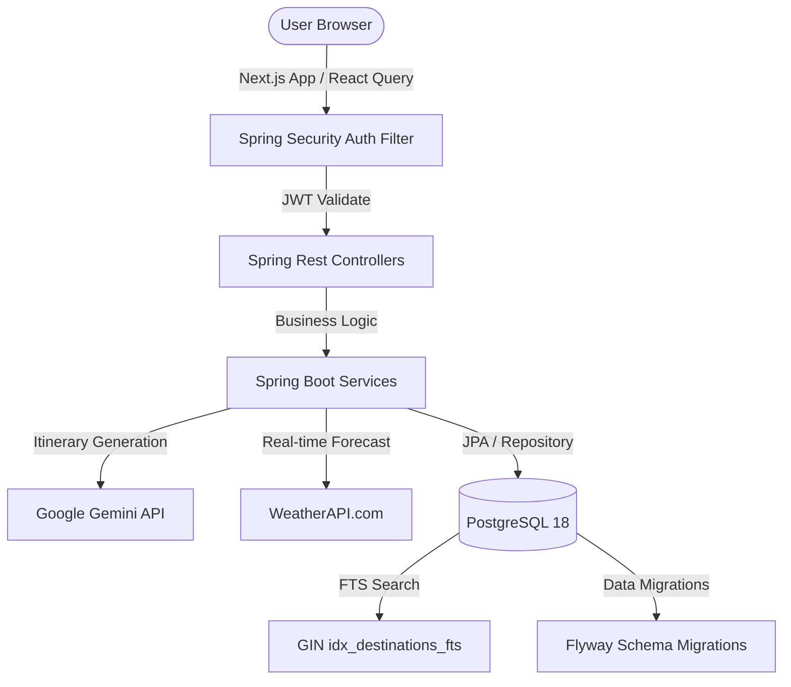

# 🌍 Trip Mind AI — AI-Powered Smart Travel Planner

[](https://nextjs.org/)
[](https://spring.io/projects/spring-boot)
[](https://www.postgresql.org/)
[](https://openjdk.org/)
[](https://www.typescriptlang.org/)

**Trip Mind AI** is a state-of-the-art, end-to-end travel intelligence and planning platform. By fusing generative AI (Google Gemini) with lightning-fast native databases (PostgreSQL) and a fluid Next.js frontend, Trip Mind AI crafts rich, personalized itineraries, tracks budgets in real time, visualizes paths on interactive maps, and offers predictive weather insights.

---

## 🚀 Key Features

### 🤖 1. Generative AI Trip Planner
- **Intelligent Itineraries:** Fully-customized multi-day travel itineraries based on destination, budget, group sizes, and pace (relaxed, balanced, fast).
- **Gemini Pro Integration:** Generates optimal, structured travel templates including hotels, activities, transport, and dining suggestions.

### 🔍 2. Native PostgreSQL Full-Text Search (FTS)
- **Gin Indexing:** Ultra-fast, indexed text search across globally popular destinations using PostgreSQL native `to_tsvector` and `plainto_tsquery`.
- **Typo Tolerance & Scoring:** High-performance ranking matching destinations instantly.

### 🗺️ 3. Interactive Mapping
- **Fluid Map Visualizations:** Built on MapLibre GL for tracking itinerary markers, routing, and geographical coordinate clustering.
- **Save & Pin:** Save favorite landmarks, restaurants, and hotels directly from the map onto your personal travel dashboard.

### 📊 4. Real-Time Budgeting & Analytics
- **Dynamic Estimates:** Interactive expense trackers categorized by stays, flights, food, and activities.
- **Budget Alerts:** Tracks budget limit vs. actual spending, warning users as they approach their category limits.

### 🔒 5. Enterprise-Grade Security
- **Stateless Authentication:** Secure JWT-based auth flow (Access + Refresh tokens).
- **OTP Verification:** Verification flows for signup actions and password resets.
- **JPA & DB Hardening:** Migrated from MySQL to clean PostgreSQL 18 schemas with constraints and clean cascade rules.

---

## 🛠️ Technology Stack

| Layer | Technologies |
| :--- | :--- |
| **Frontend** | Next.js 16 (App Router), TypeScript, Tailwind CSS, ShadCN UI, Framer Motion, Zustand, React Query, MapLibre GL |
| **Backend** | Spring Boot 3.3+, Java 21, Spring Security, Spring Data JPA, Hibernate, JWT, Maven |
| **Database** | PostgreSQL 18+, Flyway Migrations |
| **Integrations** | Google Gemini AI Studio API, WeatherAPI |

---

## 📦 System Architecture



---

## 🗄️ Database Schema & Migrations

The database schema is managed via **Flyway Migrations** (located in `backend/src/main/resources/db/migration`):

*   **`V1__init_schema.sql`**: Initial PostgreSQL structure utilizing UUIDs for users/trips and optimized relational structures.
*   **`V2__seed_initial_data.sql`**: Pre-seeds core roles (`ROLE_USER`, `ROLE_PRO`, `ROLE_ADMIN`).
*   **`V3__enterprise_features.sql`**: Configures tables for bookings, payments, trip comments, shared collaborations, and audit logs.
*   **`V4__enterprise_admin.sql`**: Adds structures for AI Prompt templates, content moderation rules, and promotional coupons.
*   **`V5__full_text_search.sql`**: Configures the functional GIN search index for destination lookups.
*   **`V6__fix_schema_mismatches.sql`**: Aligns tables (attractions, hotels, restaurants, budgets) to JPA entity schemas.
*   **`V7__fix_not_null_constraints.sql`**: Custom constraints update supporting seamless OTP & signup verification.

---

## ⚙️ Local Development Setup

### 1. Prerequisites
- **Java JDK 21**
- **Node.js 20+**
- **PostgreSQL 17+** (listening on standard port `5432`)
- **Maven 3.9+**

---

### 2. Database Creation
Connect to your local PostgreSQL instance and create the target database:
```sql
CREATE DATABASE tripmind_db;
```

---

### 3. Backend Setup
1. Copy the `.env` template file:
   ```bash
   cd backend
   cp .env.example .env
   ```
2. Open `.env` and fill in your keys:
   ```env
   SPRING_DATASOURCE_HOST=localhost
   SPRING_DATASOURCE_PORT=5432
   SPRING_DATASOURCE_DB=tripmind_db
   SPRING_DATASOURCE_USERNAME=postgres
   SPRING_DATASOURCE_PASSWORD=your_postgres_password
   
   GEMINI_API_KEY=your_gemini_api_key
   WEATHER_API_KEY=your_weather_api_key
   ```
3. Run the backend server using the custom PowerShell launcher (which handles loading your `.env` variables):
   ```powershell
   # In backend directory
   .\run.ps1
   ```
   *The API will start up on `http://localhost:8080`.*

---

### 4. Frontend Setup
1. Navigate to the frontend directory:
   ```bash
   cd ../frontend
   ```
2. Install dependencies:
   ```bash
   npm install
   ```
3. Run the Next.js development server:
   ```bash
   npm run dev
   ```
   *The portal will open at `http://localhost:3000`.*

---

## 📁 Repository Structure

```
Trip Mind AI
├── backend
│   ├── src/main/java/com/tripmind/api
│   │   ├── config/          # Spring Security, CORS, WebSocket Configs
│   │   ├── controllers/     # REST Endpoints
│   │   ├── entities/        # JPA Entities (User, Trip, Booking, etc.)
│   │   ├── repositories/    # Database Repository Layer
│   │   └── services/        # Core Business Logic (AI, Auth, Weather)
│   ├── src/main/resources
│   │   ├── db/migration/    # Flyway Migration DDLs
│   │   └── application.yml  # Spring Datasource Configurations
│   └── run.ps1              # Windows Env-loading Startup Script
└── frontend
    ├── src
    │   ├── components/      # Common UI Components
    │   ├── features/        # Feature Modules (Auth, Dashboard, Planner)
    │   ├── lib/             # API Axios clients, Maps configs
    │   └── app/             # Next.js Pages & Routes
    └── tailwind.config.ts   # Design System Tokens
```

---

## 🛡️ License

Distributed under the MIT License. See `LICENSE` for more details.
